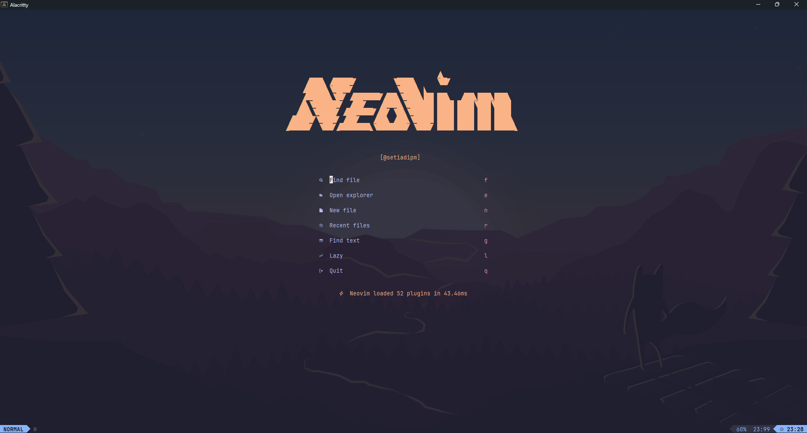
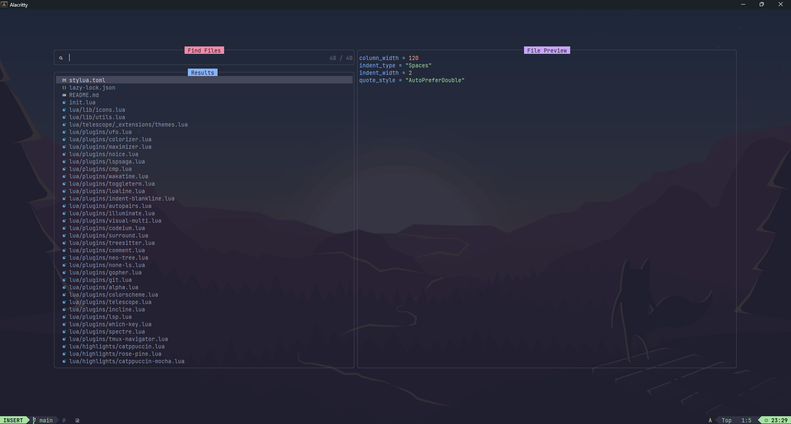
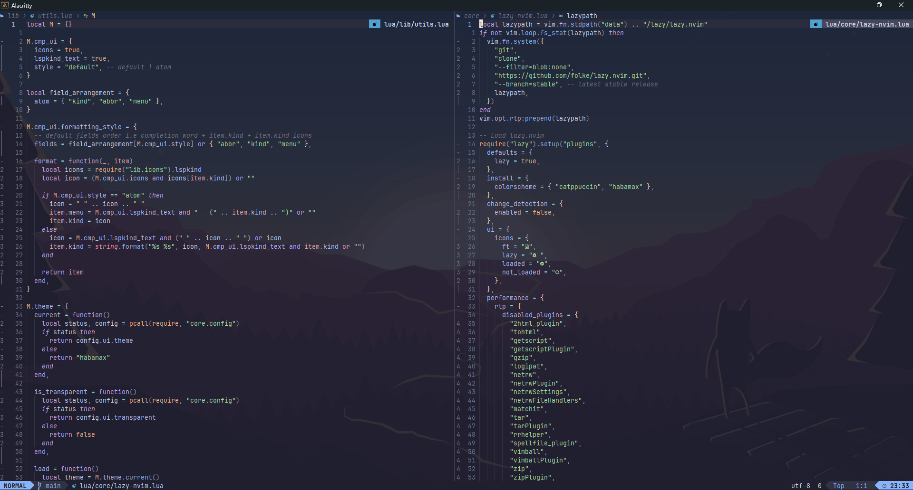
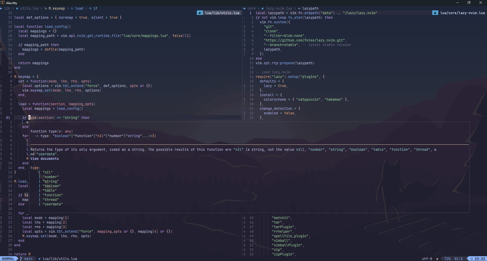
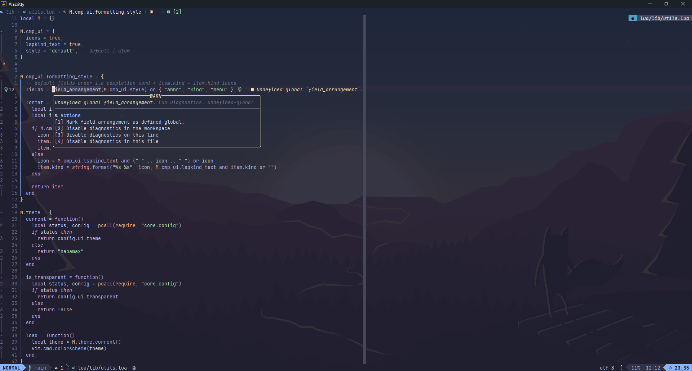

# Neovim

## 🚀 Introduction

This repository hosts my Neovim configuration powered by 💤 [Lazy.nvim](https://github.com/folke/lazy.nvim).

## 📷 Screenshots

## ✨ Detail

- File tree explorer: [neo-tree](https://github.com/nvim-neo-tree/neo-tree.nvim)
- Ultra fast file finder: [telescope.nvim](https://github.com/nvim-telescope/telescope.nvim)
- Search and replace: [nvim-spectre](https://github.com/nvim-pack/nvim-spectre)
- Faster code commenting: [comment.nvim](https://github.com/numToStr/Comment.nvim)
- Split window tool: [vim-maximizer](https://github.com/szw/vim-maximizer)
- Multiple cursors: [vim-visual-multi](https://github.com/mg979/vim-visual-multi)
- Better code folding: [nvim-ufo](https://github.com/kevinhwang91/nvim-ufo)
- User-defined mapping hint: [which-key.nvim](https://github.com/folke/which-key.nvim)
- Greeter for neovim: [alpha-nvim](https://github.com/goolord/alpha-nvim)
- Beautiful status line: [lualine.nvim](https://github.com/nvim-lualine/lualine.nvim) & [incline.nvim](https://github.com/b0o/incline.nvim)
- And more...

## ⚡️ Requirements

- [Neovim](https://github.com/neovim/neovim)
- [Git](https://git-scm.com)
- [Nerd font](https://www.nerdfonts.com/)
- [ripgrep](https://github.com/BurntSushi/ripgrep) for telescope

## 🩸 Additonal Dev Workflow Tools

- [fd](https://github.com/sharkdp/fd)
- [z](https://github.com/rupa/z)

## 🖥️ Keymaps

### General

| **Key**      | **Description**           | **Mode** |
| ------------ | ------------------------- | -------- |
| `<ESC>`      | Escape and clear hlsearch | **n**    |
| `<leader>sv` | Split window vertically   | **n**    |
| `<leader>sh` | Split window horizontally | **n**    |
| `<leader>se` | Equal split size          | **n**    |
| `<leader>sx` | Close current split       | **n**    |
| `<C-k>`      | Go to upper split         | **n**    |
| `<C-j>`      | Go to lower split         | **n**    |
| `<C-h>`      | Go to left split          | **n**    |
| `<C-l>`      | Go to right split         | **n**    |
| `<C-u>`      | Page up                   | **n**    |
| `<C-d>`      | Page down                 | **n**    |
| `<A-k>`      | Scroll up                 | **n**    |
| `<A-j>`      | Scroll down               | **n**    |
| `<C-k>`      | Move up                   | **i**    |
| `<C-j>`      | Move down                 | **i**    |
| `<C-h>`      | Move left                 | **i**    |
| `<C-l>`      | Move right                | **i**    |
| `<A-k>`      | Move line up              | **i, v** |
| `<A-j>`      | Move line down            | **i, v** |

### Comment

| **Key**       | **Description** | **Mode** |
| ------------- | --------------- | -------- |
| `<leader>gcc` | Toggle comment  | **n**    |
| `<leader>gc`  | Toggle comment  | **v**    |

### Fugitive

| **Key**      | **Description**   | **Mode** |
| ------------ | ----------------- | -------- |
| `<leader>gg` | Git (Full screen) | **n**    |
| `<leader>gv` | Git diff vertical | **n**    |

### Gitsigns

| **Key**      | **Description** | **Mode** |
| ------------ | --------------- | -------- |
| `<leader>[c` | Prev hunk       | **n**    |
| `<leader>]c` | Next hunk       | **n**    |
| `<leader>gd` | Toggle deleted  | **n**    |
| `<leader>gp` | Preview hunk    | **n**    |
| `<leader>gr` | Reset hunk      | **n**    |

### Lazy

| **Key**      | **Description** | **Mode** |
| ------------ | --------------- | -------- |
| `<leader>ll` | Lazy            | **n**    |
| `<leader>lu` | Lazy update     | **n**    |

### Maximizer

| **Key**      | **Description**       | **Mode** |
| ------------ | --------------------- | -------- |
| `<leader>sm` | Toggle maximize split | **n**    |

### Neo-tree

| **Key**     | **Description**   | **Mode** |
| ----------- | ----------------- | -------- |
| `<leader>e` | Explorer nvimtree | **n**    |

### Noice

| **Key**      | **Description** | **Mode** |
| ------------ | --------------- | -------- |
| `<leader>nh` | Noice history   | **n**    |

### Spectre

| **Key**      | **Description**            | **Mode** |
| ------------ | -------------------------- | -------- |
| `<leader>sr` | Replace in files (Spectre) | **n**    |

### Telescope

| **Key**      | **Description**        | **Mode** |
| ------------ | ---------------------- | -------- |
| `<leader>q`  | Diagnostic             | **n**    |
| `<leader>ff` | Find files (Root dir)  | **n**    |
| `<leader>fb` | Find in opened buffers | **n**    |
| `<leader>fr` | Resume find            | **n**    |
| `<leader>fg` | Grep                   | **n**    |
| `<leader>fk` | Key maps               | **n**    |
| `<leader>fs` | Find word (Root dir)   | **n**    |
| `<leader>gc` | Show git commits       | **n**    |
| `<leader>gs` | Show git status        | **n**    |
| `<leader>th` | Theme switcher         | **n**    |

### Toggleterm

| **Key** | **Description**        | **Mode** |
| ------- | ---------------------- | -------- |
| `<A-i>` | Toggle floating term   | **n**    |
| `<A-h>` | Toggle horizontal term | **n**    |
| `<A-v>` | Toggle vertical term   | **n**    |

### Ufo

| **Key** | **Description** | **Mode** |
| ------- | --------------- | -------- |
| `za`    | Toggle fold     | **n**    |
| `zR`    | Open all folds  | **n**    |
| `zM`    | Close all folds | **n**    |

### Which Key

| **Key**      | **Description**       | **Mode** |
| ------------ | --------------------- | -------- |
| `<leader>wk` | Which-key all keymaps | **n**    |
